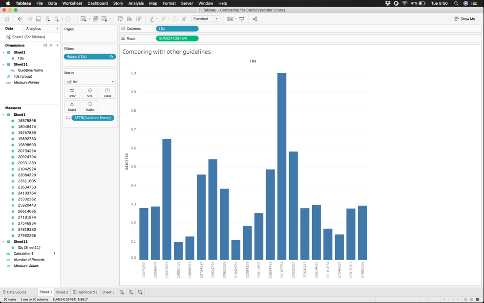

# IndividualStudy
Work done on visualizing conceptual similarity amongst medical guidelines

## Problem:  
Visually represent the proximity of medical guidelines. Understand how closely a medical guideline is related to other medical guidelines.

## What the visualization does: 
The visualization takes the matrix of guidelines as input and plots the connection between two guidelines as an output.
<ul>
<li> Components of the visualization – 
<li> chorddiagram.html – This file holds the html code for the code diagram
<li> Style.css – This contains the css standards for the visualization of the diagram.
<li> Foursix.json – This file contains Cardio vascular Ranks as a json file.
<li> Sevennine.json – This file contains Cardio vascular scores as a json file.
		Data in these json files serve as a parameter while plotting the chord lengths.
<li> Chord.js – Contains the javascript code for the diagram
<li> Regionfish.csv – This file contains all the medical guidelines with color code for each guideline

</ul>

## Motivation behind Chord diagram:
We intended to produce a dynamic diagram since a static diagram would have been too messy particularly when the data to be represented is a lot. With the chord diagram being dynamic, user gets to be more interactive with the diagram and is able to extract more information from the visualization. The javascript file uses the two json files for plotting the data. Here we prepare the json file after scaling the data to understand the difference better. We have used the following formula to scale the data: 

## Features of the chord diagram:

### Highlight a specific guideline and understand its relationship with other guidelines:
<ul>
<li> The chord diagram shows how each guideline is related to other guideline. Each guideline here is color coded in a file called “regionfish.csv”.
<li> If you wish to focus on a particular guideline, just take your mouse on that guideline and focus will shifted to that particular guideline only.
</ul>

### Understanding quantitative relation amongst guidelines:
<ul>
<li> When the chord diagram is plotted, you can see the score or the ranking of these guidelines by simply taking your mouse to the chord.
<li> For e.g., let’s just say you are interested in #19892750 guideline, you can simply take your mouse on the orange area (color code for #19892750 guideline) you can see how the ranks of these guidelines are represented. Here you can clearly see that 27819383 and our guideline has a thicker chord as compared to other chords. 
<li> If you wish to see how much the value of the chord is, you can simply take your mouse on the chord and the number will be displayed. Of course, every guideline has biggest similarity with itself which is why there will always be a self-chord with largest thickness
</ul>

### Highlight a guideline to display its full name:
<ul>
<li> We know it is difficult to understand what the guideline is just by looking at its number which is why if you take your mouse over to the guidelines number on the right panel, you would be able to see the full name of the medical guideline.

<li>Obvious reason for giving medical guideline number instead of the name is to fit the data on the chord diagram.
</ul>

### Quick access to the medical guideline:
o	If you wish to access the medical guideline and know more about the guideline, just click on the guideline number on the right panel.
o	What this will do is it will direct you to the XXX page with the guideline that you are interested in and have full availability of the guideline.

## Limitations of the Chord Diagram:

### Too many chords for cardio
o	Understanding the diagram, with so many chords becomes a difficult task. We are interested in understanding which guideline has a thicker chord to the other guideline but with 21x21 guidelines with each guideline having a chord to every other guideline, it becomes difficult to interpret the diagram.

### Little complicated to understand
o	Since Chord diagram is supposed to display two-way information, i.e. Distance from guideline A to B and B to A, we cannot really get a clear idea of which guidelines are similar to other guidelines.

### Motivation of bar-chart:
We avoided bar charts because they seemed common and boring. We later realized our initial assessment was wrong. We should use them and use them frequently because they are common. With bar chart, users already know how to read them and can focus on what the data actually says. That is the beauty of simple bar charts. Using bar chart for the data of medical guidelines, we intend to present the story of how certain guidelines are conceptually similar to other guidelines.

### Enhancement to the existing chord diagram: 

<ul>
<li> A simpler approach of bar-chart was suggested to overcome the problem of understanding the complicated nature of guidelines. We decided not to skip the chord diagram entirely, as they present valuable information for breast cancer guidelines.

<li>We proposed to add a hyperlink which displays the distance of one guideline to all the other guidelines. Using bar-chart, you can easily understand and interpret the story.
</ul>

## How Chord diagram and Bar chart work hand in hand:

Using the chord diagram, user can get brief idea of which guidelines has more similarity or has thicker chord to other guidelines. Then, user can click on the link next to that guideline and see how the bar chart is displayed for this particular guideline. Using bar chart, user can interpret which guidelines are similar to the selected guideline and view the bar chart for the new guidelines and compare the results.

Without Chord diagram user would need to go through 21 bar charts to view the results and it would be confusing and a difficult task to achieve.

### Features of the updated Chord diagram:
<ul>
<li> This chord diagram shows a bar chart link next to each guideline. This link opens up a bar chart view for each guideline in a new tab.

<li> Additional to all the previous features, what this does is gives a preview to the bar chart when you hover your mouse over the link of the bar chart. How this can help is user can preview the minute details as to which guideline is closest to the selected guideline apart from the selected guideline.

</ul>

### Bar-chart features:
<ul>
<li>As mentioned, the purpose of bar-chart is to put our analysis in the simplest form possible to help the user interpret the results. On X-axis, are the guidelines, while on the Y-axis, there is percentage cosine similarity, with maximum similarity of each document with itself at 100%.
	
	

<li>	Additional important feature of this bar-chart is that it shows the score in-side the bar. This conceptually and numerically represents the similarity amongst the guidelines.

<li>Another feature to this bar-chart is to compare measurably how high is the similarity of a particular guideline to other guidelines. For this comparison, a dashed-line is plotted with reference to selected guideline and the numbers in the bar change. The new number now shows, how high is the distance.
</ul>

## Visualizing using Tableau:

Dashboards are one of the most common use cases for data visualization, and their design and contexts of use are considerably different from exploratory visualization tools. With drag -and-drop feature, Tableau promotes not only an intuitive flow, but also rapid and flexible cohort analysis. For example, with just a few calculated fields and some drag-and-drop operations, you can create a dashboard that shows similarity of the guidelines using the simplest to understand bar-charts and enables an important aspect of selecting which guideline to choose for comparison.

Using drag and drop feature, you can select the guideline you wish to compare, and drag it to the Rows field. In the Columns field, we will drag all the IDs. This brings up the above view and simply displays the bar-chart without writing any piece of code.

From this figure, we can say that 2364753, 19257889, 25332362 are closely similar to 24103764.
Since it becomes difficult to understand what these guidelines actually are. We can view the name of the guideline when we hover the mouse on top of the bar chart.

### Plotting multiple guidelines in the same view:

### What it does:
<ul>
<li> This view is a relative view. Here we selected one guideline as the base guideline and then you can select/configure the secondary guideline to compare with the primary guideline.

<li>Since this is a simple drag/drop operation, we can have multiple iterations of the comparisons.
</ul>

Hand-picking interesting guidelines for comparison

### What it does: 
We can compare selected guidelines to see the similarity and bucket them together in terms of similarity or dissimilarity.
From our above example, we can say that 19257889, 23634753, 24103764, 25332362 are conceptually similar since they exhibit high similarity with respect to three base guidelines selected in the view one.

